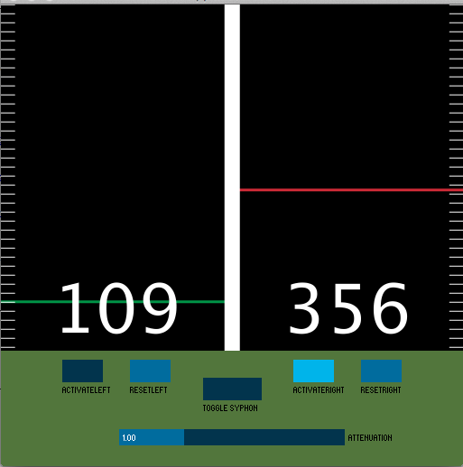

## Applausometer

Applausometer can be used in conjuction with a Syphon enabled software (thus it's limited to OS-X) to project and evaluate the "noise" of two goups of people. 

It uses the core processing library _minim_ and the [Syphon library for Processing](https://code.google.com/p/syphon-implementations/downloads/detail?name=SyphonProcessing-1.0-RC1.zip&can=2&q=)

## Caution

With some software the Syphon output can be delivered upside-down, you can use a flip filter to adjust the image, it is the faster and lighter solution for this issue.

Tested with Processing 2.0.3
